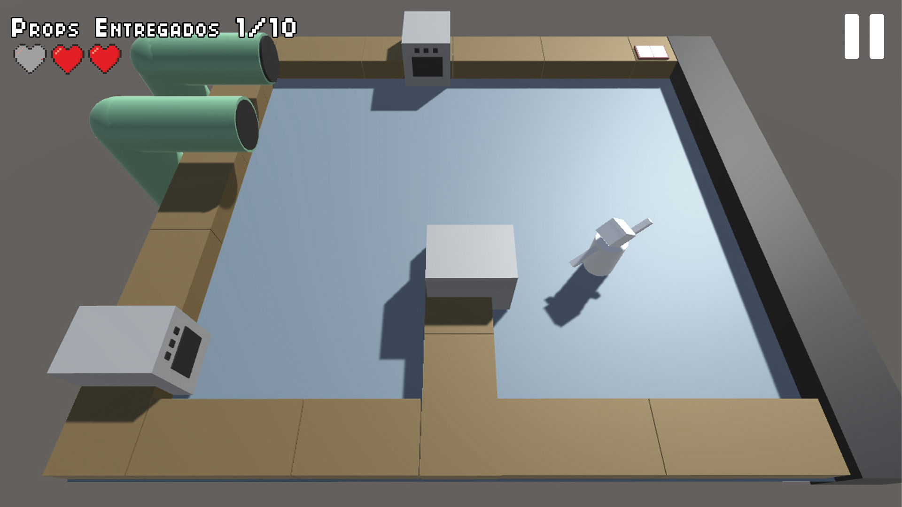

## Game Design Document

# Índice

* 1\. [Introduccion](#introduccion)
  + 1.1\. [Concepto](#Concepto)
  + 1.2\. [Características principales](#Caracteristicasprincipales)
  + 1.3\. [Género](#Genero)
  + 1.4\. [Estilo Visual](#EstiloVisual)
  + 1.5\. [Alcance](#Alcance)
  + 1.6\. [Jugabilidad](#Jugabilidad)
  + 1.7\. [Propósito y público objetivo](#Propositoypublicoobjetivo)
* 2\. [Mecánicas del juego](#mecanicas)
  * 2.1\. [Jugabilidad](#Jugabilidad)
  * 2.2\. [Props](#Props)
  * 2.3\. [Puntos de interacción](#Puntosdeinteraccion)
  * 2.4\. [Flujo de juego (Game Loop)](#FlujodejuegoGameLoop)
  * 2.5\. [Cámara](#Camara)
  * 2.6\. [Controles](#Controles)
  * 2.7\. [Niveles](#Niveles)
* 3\. [Interfaz](#interfaz)
  * 3.1\. [Diagrama de Flujo](#DiagramadeFlujo)
  * 3.2\. [Pantalla de Menú principal](#PantalladeMenuPrincipal)
  * 3.3\. [Pantalla de Opciones](#PantalladeOpciones)
  * 3.4\. [Pantalla de Créditos](#PantalladeCreditos)
  * 3.5\. [Pantalla de Selección de nivel](#PantalladeSelecciondenivel)
  * 3.6\. [Pantalla de Nivel (HUD)](#PantalladeNivel)
  * 3.7\. [Pantalla de Pausa](#PantalladePausa)
  * 3.8\. [Pantalla de Fin del nivel](#PantalladeFindelnivel)
  * 3.9\. [Pantalla de Game Over](#PantalladeGameOver)
  * 3.10\. [Notificaciones](#Notificaciones)

* 4\. [Arte y Sonido](#arteysonido)
  * 4.1\. [Arte](#Arte)
  * 4.2\. [Sonido](#Sonido)
* 5\. [Roles](#roles)

</ol>

# **1. Introducción**

*Game Maker Maker* es un videojuego para *navegador y dispositivos móviles*, con estética 3D, desarrollado mediante el motor de videojuegos Unity. En este documento se van a plasmar los aspectos relacionados con el diseño fundamental del videojuego, de forma que nos sirva como carta de presentación ante futuros colaboradores.

</ol>

## **1.1. Concepto**

*Todos conocemos las setas de Super Mario, las Pokebolas de Pokémon, o las frutas del Pac-Man, pero ¿de dónde vienen? En Game Maker Maker, ¡tenemos la respuesta! ¡Ponte en  los zapatos de un empleado de la fábrica mundial de props, y prepárate para dar vida a todas esas sagas que tanto adoras! Pero, cuidado: no va a ser tarea fácil. Necesitarás mucha rapidez y coordinación. ¿Estarás a la altura del reto que supone ser un verdadero creador de videojuegos?*

El juego nos pone en los zapatos de un empleado de una **fábrica de "props" de videojuegos,** es decir, de todos aquellos objetos (decorativos o no) que se utilizan para su desarrollo (ejemplo: una seta de *Super Mario*, una mesa, un arma, etc.).  Así, la intención del juego será proponer una idea graciosa y atractiva, en la que muchos jugadores puedan reconocer guiños a sus sagas favoritas, al mismo tiempo que experimentan una jugabilidad muy similar a la de juegos como *Overcooked!.*

Comenzaremos en un pequeño escenario, visto desde arriba, donde tendremos una **cinta transportadora** (por la que van llegando objetos para ser tratados), varios **puntos de preparación** para llevar a cabo el tratamiento, y mesas vacías para depositar objetos temporalmente. De igual manera, se dispondrán de un par de **puntos de entrega** de props, dependiendo del videojuego al que pertenezcan.

Al empezar la partida, comienzan a llegar objetos por la cinta. El jugador debe recogerlos, introducirlos en la estación de preparación correspondiente (según el objeto), y entregarlos a la estación del videojuego al que pertenecen. Si, durante el proceso, **alguno de los objetos de la cinta no es recogido, perderá una de las vidas de las que dispone** (al perder todas, fin de la partida). Si, por el contrario, consigue **preparar y entregar todos los props, completará el nivel satisfactoriamente** y podrá avanzar al siguiente, que será un mayor reto de dificultad.

Para elaborar los props, deberá atenderse a la **"receta"** de cada uno, es decir, al conjunto de pasos necesarios para elaborarlo. Así, por ejemplo, un prop necesitará pasar por la estación de tratamiento A y B, mientras otro sólo necesitará pasar por la A. 

El diseño de los puntos de preparación será lo más intuitivo posible para permitir que el jugador pueda inferir en cuál debería introducir el prop, pero, a fin de recompensar la memoria y atención del jugador, se dispondrá de un **"libro de recetas"** en el cual se especificará el proceso de elaboración de cada prop. Dicho libro se visualizará una vez al empezar la partida, y posteriormente, yendo a un punto clave del escenario donde se situará (ir a mirarlo en medio de la partida implicará perder tiempo y dejar desatendida la cinta transportadora, por lo que supondrá un reto intentar recordar las recetas, o intuirlas).

</ol>

## **1.2. Características principales**

* **Controles sencillos:** los controles del juego consistirán en un sistema **"Point & Click",** en el que el usuario tocará la pantalla de su móvil (o hará click con el ratón) en el punto al que desea moverse, el objeto que desea recoger, o el elemento con el que desea interactuar. Al hacerlo, el personaje comenzará a desplazarse hasta el punto marcado y realizar la acción determinada. Si, en el proceso, se toca o selecciona otro punto, la acción anterior quedará anulada y se realizará la nueva. 

* **Cámara:** la cámara estará situada de forma que **se contemple todo el nivel desde arriba,** de forma casi cenital, pero con un ángulo de inclinación suficiente como para poder apreciar el 3D (no es totalmente perpendicular al suelo). Su comportamiento será estático, de forma que apenas tendrá movimiento durante el juego.

* **Ritmo dinámico: **las mecánicas básicas del juego dan lugar a un** ritmo ágil y rápido**, de forma que el jugador nunca experimente un momento aburrido o predecible, si no que el juego le mantenga alerta y con ganas de superar nuevos retos.

* **Jugabilidad extensible**: sistema de niveles y flujo de juego acorde a ellos, lo cual otorga al juego de alta escalabilidad para añadir contenido en un futuro.

* **Temática divertida:** la naturaleza de la premisa del juego, así como de la sencillez de sus mecánicas, dan lugar a una dinámica final que busca provocar la sonrisa en el jugador, al mismo tiempo que atraparle en su jugabilidad.

</ol>

## **1.3. Género**

El género del juego es de tipo **"Simulación" o “Arcade”,** donde el personaje debe completar una serie de tareas dinámicas, con un ritmo rápido que le impide acomodarse o permanecer ocioso, y con dificultad progresiva en sus niveles, como una cadena de montaje. El ejemplo más claro que se adapta a la fórmula del juego es *Overcooked!*, aunque en general se inspira en aspectos comunes en los juegos de índole “for fun”.

</ol>

## **1.4. Estilo Visual**

La estética tendrá un estilo visual de **temática cartoon,** no realista, y será generalmente de aspecto amigable, colores pintorescos y animaciones exageradas, y contará con un arte propio y diferenciable.

A modo de parodia al desarrollo de videojuegos en general, algunos elementos de la estética buscarán imitar un "blockout" 3D, por ejemplo, el personaje principal (que se llama *GameObject*) tendrá una apariencia goofy e infantil, muy similar a un personaje de CAT (basado en cubos y primitivas de colores), etc. Esto supondrá un contraste con los props más elaborados de las sagas que el juego comprende, de forma que se realza la naturaleza cómica del juego.

</ol>

## **1.5. Alcance**

Debido a que el juego está planteado por niveles, dispondrá de una gran escalabilidad, de forma que siempre se podrán añadir niveles diferentes, con distintas distribuciones de sus elementos en el espacio, juegos y props nuevos.

</ol>

## **1.6. Jugabilidad**

Los niveles serán realizados de forma progresiva y tendrán distintos niveles de dificultad. Las características principales de los niveles serán:

* **Dificultad incremental:** los niveles avanzados presentarán un reto mayor, debido a un número incrementado de elementos que gestionar, y al propio diseño del nivel.

* **Diferentes props:** Cada nivel dispondrá de un número de props diferente. De esta manera, por ejemplo, el primer nivel tendrá 4 props, de 2 juegos diferentes.

* **Controles "Point & Click":** los controles, como se ha mencionado anteriormente, junto a la cámara aérea, permitirán visualizar y manipular el nivel en su completitud, posibilitando al usuario gestionar todos los props, puntos de interacción y demás elementos del escenario.

</ol>

## **1.7. Propósito y público objetivo**

Nuestro objetivo es obtener un juego 3D, de estética atractiva y llamativa, rápido, dinámico y relativamente simple (lo suficiente para ser jugable en la pantalla de un dispositivo móvil), que sirva para entretener durante los momentos aburridos del jugador.

Es un juego **apto para todos los públicos,** tanto para los amantes de los juegos de móvil como para un perfil de jugador más ocasional o "casual", y disfrutable en cualquier momento (en viajes, en casa, etc). 

Nuestro objetivo sería cumplir un **PEGI 3,** puesto que el juego será apto para todas las edades, sin lenguaje soez o desnudez explícita. La "violencia" del juego será mínima y estará limitada a un contexto de tipo dibujo cómico animado (como pueden ser los dibujos de *Tom y Jerry*), por lo que niños de todas las edades podrán disfrutar del juego.

</ol>

# **2. Mecánicas del juego**

En esta sección, trataremos todas las cuestiones referentes al funcionamiento básico y avanzado del juego, así como los diferentes props y elementos involucrados en él, y se explicarán controles, mapa y desarrollo de una "partida típica".

</ol>

## **2.1. Jugabilidad**

* **Niveles:** los niveles del juego consistirán en una planta de montaje de la fábrica de props, con cintas transportadoras, elementos de almacenaje y elaboración, etc. En cada nivel, dispondremos de un **número determinado de props que deberemos completar para superarlo, con un número específico de vidas.** Si un prop no es recogido de la cinta transportadora (caerá a la papelera situada al final de la misma), se perderá una vida.

Una descripción detallada se encontrará en la sección **Niveles**.

* **Dificultad:** la dificultad irá aumentando con cada nivel, de forma que un nivel más avanzado tendrá una distribución más compleja y complicada de navegar, un mayor número de props y sagas a las que pertenecen, y más complejidad en las "recetas" de éstos.

* **Puntos de interacción:** los niveles tendrán diferentes puntos de preparado y entrega de props. 

Cuando un prop es introducido en un **punto de preparado,** se comienza a tratar, mostrando un pequeño indicador radial, superpuesto en el elemento, de cuánto falta para finalizar la elaboración. Al terminar, deberá ser recogido inmediatamente, pues de lo contrario la estación se sobrecargará, quedando inutilizada unos segundos y perdiendo el prop que contiene (de forma similar a si se quemase una sartén en *Overcooked!*).

Una vez preparado, cuando haya pasado por todos los puntos necesarios según su "receta", deberemos llevar el resultado a un **punto de entrega**, y depositarlo en el que corresponda, en función de su saga. Si se deposita en el punto de entrega equivocado, dicho punto quedará inutilizado unos instantes, y perderemos el prop.

Una descripción detallada se encontrará en la sección **Puntos de interacción**.

* **Props:** los niveles tendrán diferentes props, de sagas conocidas, a modo de guiño gracioso y atractivo para el usuario, que deberá recogerlos de la cinta transportadora, y llevarlos a los puntos de preparación correspondientes, para posteriormente recogerlos de éstas y depositarlos en las de entrega que encajen con el juego al que pertenece. 

Si el usuario tiene sobrecarga de props, y necesita recoger alguno de la cinta para no perderlo, puede depositarlos en diferentes "mesas" dispuestas por el nivel (abundantes, pero limitadas).

Una descripción detallada se encontrará en la sección **Props**.

* **Progresión del jugador:** para incentivar la rejugabilidad y búsqueda de un reto por parte del jugador, se incorporará un sistema de puntuación, animandole a jugar a otra partida para superar su puntuación o la de sus amigos. Este sistema tendrá en cuenta diversos factores: el tiempo que se ha tardado en completar el nivel, número de props entregados en la saga correcta, número de puntos de preparado sobrecargados, etc.

Debido a la naturaleza del juego, y su estructura por niveles, se ha decidido tomar el modelo de puntuación de juegos exitosos como *Angry Birds* o *Candy Crush*, basado en estrellas, en lugar de un contador numérico, ya que han demostrado que este sistema funciona mejor para este tipo de juegos.

</ol>

## **2.2. Props**

A continuación se detallan los props utilizados en el videojuego, con los datos respectivos de cada uno:

<table>
  <tr>
    <td>Nombre</td>
    <td>Saga</td>
    <td>Nivel</td>
  </tr>
  <tr>
    <td>Champiñón rojo</td>
    <td>Super Mario Bros</td>
    <td>1, 2, 3, 6, 7, 8</td>
  </tr>
  <tr>
    <td>Caparazón verde</td>
    <td>Super Mario Bros</td>
    <td>1, 2, 3, 6, 7, 8</td>
  </tr>
  <tr>
    <td>Cereza</td>
    <td>Pac-Man</td>
    <td>1, 3, 4, 7, 8</td>
  </tr>
  <tr>
    <td>Manta de fantasma</td>
    <td>Pac-Man</td>
    <td>1, 3, 4, 7, 8</td>
  </tr>
  <tr>
    <td>Cubo de compañía</td>
    <td>Portal</td>
    <td>4, 5, 6, 8</td>
  </tr>
  <tr>
    <td>Torreta</td>
    <td>Portal</td>
    <td>4, 5, 6, 8</td>
  </tr>
  <tr>
    <td>Pokeball</td>
    <td>Pokémon</td>
    <td>5, 6, 7, 8</td>
  </tr>
  <tr>
    <td>Gorra de entrenador</td>
    <td>Pokémon</td>
    <td>5, 6, 7, 8</td>
  </tr>
  <tr>
    <td>Tri-Fuerza</td>
    <td>The Legend of Zelda</td>
    <td>7,8</td>
  </tr>
  <tr>
    <td>Máscara de Majora</td>
    <td>The Legend of Zelda</td>
    <td>7,8</td>
  </tr>
  <tr>
    <td>Pico</td>
    <td>Minecraft</td>
    <td>2, 3, 4, 5, 6, 8</td>
  </tr>
  <tr>
    <td>Diamante</td>
    <td>Minecraft</td>
    <td>2, 3, 4, 5, 6, 8</td>
  </tr>
</table>

</ol>

## **2.3. Puntos de interacción**

A continuación se concretan los diferentes puntos de elaboración de props:

* **Texturizador:** otorga las texturas necesarias al prop, por lo que es bastante utilizado. Este punto de interacción será el más crítico debido al número de assets que deben introducirse aquí y por ello habrá varias unidades en el juego.

* **Fundición de metales:** utilizado para crear todos aquellos objetos metálicos, que necesitan un material especialmente resistente.

* **Caldero mágico:** utilizado para crear objetos mágicos o especiales.

En la siguiente tabla podemos ver qué procesos o recetas requiere cada objeto, en relación a los diferentes puntos de elaboración:

<table>
  <tr>
    <td>Nombre</td>
    <td>Texturizador</td>
    <td>Metales</td>
    <td>Magia</td>
  </tr>
  <tr>
    <td>Champiñón rojo</td>
    <td>x</td>
    <td>-</td>
    <td>x</td>
  </tr>
  <tr>
    <td>Caparazón verde</td>
    <td>x</td>
    <td>-</td>
    <td>-</td>
  </tr>
  <tr>
    <td>Cereza</td>
    <td>x</td>
    <td>-</td>
    <td>x</td>
  </tr>
  <tr>
    <td>Manta de fantasma</td>
    <td>x</td>
    <td>-</td>
    <td>-</td>
  </tr>
  <tr>
    <td>Cubo de compañía</td>
    <td>x</td>
    <td>x</td>
    <td>-</td>
  </tr>
  <tr>
    <td>Torreta</td>
    <td>x</td>
    <td>x</td>
    <td>-</td>
  </tr>
  <tr>
    <td>Pokeball</td>
    <td>x</td>
    <td>x</td>
    <td>x</td>
  </tr>
  <tr>
    <td>Gorra de entrenador</td>
    <td>x</td>
    <td>-</td>
    <td>-</td>
  </tr>
  <tr>
    <td>Tri-Fuerza</td>
    <td>x</td>
    <td>x</td>
    <td>x</td>
  </tr>
  <tr>
    <td>Máscara de Majora</td>
    <td>x</td>
    <td>-</td>
    <td>x</td>
  </tr>
  <tr>
    <td>Pico</td>
    <td>x</td>
    <td>x</td>
    <td>-</td>
  </tr>
  <tr>
    <td>Diamante</td>
    <td>x</td>
    <td>x</td>
    <td>-</td>
  </tr>
</table>

Por otro lado, podemos apreciar los diferentes puntos de entrega para cada saga:

* **_Super Mario Bros:_** una tubería verde, típica de este videojuego.

* **_Pac-Man:_** un "comecocos" gigante, que engulle los props entregados.

* **_Portal:_** un portal naranja, a no se sabe muy bien dónde.

* **_Pokémon:_** el clásico PC de Bill.

* **_The Legend of Zelda:_** *el típico cofre visto en la saga.* 

* **_Minecraft:_** una mesa de crafting.

En la siguiente tabla podemos ver qué puntos de entrega corresponden a cada objeto:

<table>
  <tr>
    <td>Punto de entrega</td>
    <td>Objetos entregables</td>
  </tr>
  <tr>
    <td>Tubería verde (Super Mario Bros)</td>
    <td>Champiñón rojo, caparazón verde</td>
  </tr>
  <tr>
    <td>Comecocos (Pac-Man)</td>
    <td>Cereza, manta de fantasma</td>
  </tr>
  <tr>
    <td>Portal naranja (Portal)</td>
    <td>Cubo de compañía, torreta</td>
  </tr>
  <tr>
    <td>PC de Bill (Pokémon)</td>
    <td>Pokeball, gorra de entrenador</td>
  </tr>
  <tr>
    <td>Cofre (The Legend of Zelda)</td>
    <td>Tri-Fuerza, máscara de Majora</td>
  </tr>
  <tr>
    <td>Mesa de crafteo (Minecraft)</td>
    <td>Pico, diamante</td>
  </tr>
</table>

</ol>

## **2.4. Flujo de juego (Game Loop)**

*Nota: las siguientes imágenes son esquemáticas e ilustrativas, y su perspectiva y disposición visual no se corresponde necesariamente con el aspecto real.*

El Game Loop estándar de una partida consistirá en lo siguiente:

* Al comenzar la partida, **se visualizará una sola vez el libro de recetas,** para que el jugador pueda apreciar en un solo vistazo qué props deberá elaborar y cómo es el proceso. Si el jugador se toma la molestia de memorizar los pasos, será recompensado al resultar más fácil la partida.

* Una vez cerrado el libro de recetas, comienza la partida como tal. Continuamente **van llegando props por la cinta transportadora** del escenario. **Si alguno de ellos no es recogido por el jugador,** sino que llega a la papelera situada al final de la cinta, **el jugador perderá una vida.**

* La mecánica principal consistirá en que el jugador vaya a la cinta a recoger un prop, y de ahí lo lleve al **punto de preparación** que corresponda según su receta. Una vez se esté preparando, deberá estar atento de **no dejarlo ahí demasiado tiempo, pues el punto se sobrecargará,** quedando inutilizado unos instantes y perdiendo el prop.

* Si todos los puntos de preparación están ocupados, pero siguen apareciendo props por la cinta, para evitar perderlos el jugador podrá recogerlos para **depositarlos en las mesas vacías del nivel** (que aunque abundantes, son limitadas, por lo que tampoco puede depositar absolutamente todos los props y detener así el ritmo de juego).

* Una vez se haya completado el proceso de preparación de un prop, pasando por todos los puntos necesarios, se deberá recoger y llevar al **punto de entrega de la saga a la que pertenezca.** Si se deposita en un punto de entrega erróneo, éste quedará inutilizado unos instantes, y se perderá el prop.

* En caso de que el jugador no recuerde o no sea capaz de deducir correctamente cuál es el proceso de preparación de un prop, es decir, su receta, **podrá consultar el libro visto al empezar la partida en algún punto del escenario,** aunque ir hasta allí, y visualizarlo, implica perder tiempo mientras aparecen props por la cinta, incentivando así al jugador a intentar memorizar o intuir las recetas en lugar de consultarlas continuamente.

* Una vez se hayan **entregado el número de props necesario, se superará el nivel satisfactoriamente,** pudiendo visualizar la puntuación obtenida y pasando al siguiente nivel, si procede. Si, por el contrario, no es capaz de elaborar el número de props requerido, sino que en su lugar **pierde todas las vidas de las que dispone, perderá la partida,** teniendo que reiniciar el nivel.

</ol>

## **2.5. Cámara**

La cámara del juego será **fija o estática, con una perspectiva aérea,** casi cenital, de forma que permita visualizar la totalidad del nivel en pantalla, al mismo tiempo que se aprecia la profundidad y el 3D del juego.

</ol>

## **2.6. Controles**

Los controles consistirán únicamente del **click o pulsación sobre la región de la pantalla, propios del tipo "Point & Click".** Por lo tanto, pulsar sobre un lugar, el personaje se desplazará hacia dicho punto. Si pulsamos sobre un objeto, el personaje se desplazará hasta él, y posteriormente lo recogerá o realizará la acción correspondiente. Para mostrar visualmente qué es lo que va a hacer el personaje, **se mostrará un pequeño indicador visual sobre el punto** del mapa o el objeto determinado.También se dará un **feedback auditivo** de que se ha realizado una petición (click). 

Cabe mencionar que, si mientras se está desplazando o realizando una acción, recibe otra orden (hacemos click en otro punto de la pantalla), **se anulará la acción anterior, dando prioridad a la nueva.**

Al **pulsar** en un lugar donde **no hay una acción** (por ejemplo, una mesa vacía cuando no tenemos objetos equipados, o fuera del escenario) **el personaje no hará nada**, es decir, cancelará su acción actual pero no hará nada más, quedándose en su sitio hasta que se le indique una acción válida. Se **reproducirá un sonido** que indica que es un movimiento prohibido o sin valor, además de **un pequeño indicador visual** sobre el personaje.

A continuación se incluye una tabla que explica cada interacción posible durante el juego:

<table>
  <tr>
    <td>Prop</td>
    <td>Con objeto equipado</td>
    <td>Sin objeto equipado</td>
  </tr>
  <tr>
    <td>Horno vacío</td>
    <td>El personaje se mueve al horno e inserta el objeto dentro.</td>
    <td>Acción no válida. El personaje se mantiene en el lugar y se notifica</td>
  </tr>
  <tr>
    <td>Horno lleno completado</td>
    <td>Acción no válida. El personaje se mantiene en el lugar y se notifica.</td>
    <td>El personaje se desplaza al horno y recoge el objeto cocinado de su interior.</td>
  </tr>
  <tr>
    <td>Horno lleno no completado</td>
    <td>Acción no válida. El personaje se mantiene en el lugar y se notifica.</td>
    <td>El personaje se desplaza al horno y recoge el objeto sin cocinar de su interior.</td>
  </tr>
  <tr>
    <td>Horno roto</td>
    <td>Acción no válida. El personaje se mantiene en el lugar y se notifica.</td>
    <td>Acción no válida. El personaje se mantiene en el lugar y se notifica</td>
  </tr>
  <tr>
    <td>Lugar de la cinta con objeto</td>
    <td>Acción no válida. El personaje se mantiene en el lugar y se notifica.</td>
    <td>El personaje se desplaza hasta el objeto y lo recoge.</td>
  </tr>
  <tr>
    <td>Lugar de la cinta sin objeto</td>
    <td>Acción no válida. El personaje se mantiene en el lugar y se notifica.</td>
    <td>Acción no válida. El personaje se mantiene en el lugar y se notifica.</td>
  </tr>
  <tr>
    <td>Libro</td>
    <td>El personaje se desplaza al libro e interactúa con el.</td>
    <td>El personaje se desplaza al libro e interactúa con el.</td>
  </tr>
  <tr>
    <td>Tubería</td>
    <td>El personaje deposita el objeto en la tubería</td>
    <td>Acción no válida. El personaje se mantiene en el lugar y se notifica.</td>
  </tr>
  <tr>
    <td>Tubería rota</td>
    <td>Acción no válida. El personaje se mantiene en el lugar y se notifica.</td>
    <td>Acción no válida. El personaje se mantiene en el lugar y se notifica.</td>
  </tr>
    <tr>
    <td>Sobre algo no interactivo</td>
    <td>Acción no válida. El personaje se mantiene en el lugar y se notifica.</td>
    <td>Acción no válida. El personaje se mantiene en el lugar y se notifica.</td>
  </tr>
  <tr>
    <td>Movimiento (lugar del escenario dentro del NavMesh)</td>
    <td>El personaje se desplaza hasta el punto marcado.</td>
    <td>El personaje se desplaza hasta el punto marcado.</td>
  </tr>
  <tr>
    <td>Mesa vacía</td>
    <td>El personaje se desplaza hasta la mesa y deposita el objeto en la mesa.</td>
    <td>Acción no válida. El personaje se mantiene en el lugar y se notifica</td>
  </tr>
  <tr>
    <td>Mesa llena</td>
    <td>Acción no válida. El personaje se mantiene en el lugar y se notifica</td>
    <td>El personaje se desplaza hasta la mesa y recoge el objeto de la mesa a sus manos.</td>
  </tr>
</table>

</ol>

## **2.7. Niveles**

En la idea inicial, se podían diferenciar **dos niveles completos distintos,** con props y distribución espacial diferentes. Posteriormente, se ha planteado ampliar la lista de niveles del juego, debido a la gran escalabilidad del sistema, gracias a la implementación de un editor de niveles por parte del equipo de desarrollo.

Un ejemplo de diseño de nivel esquemático sería el siguiente:

Los mapas tendrán un número de **puntos de preparación ("hornos")** distintos repartidos por el escenario, a la vez que una serie **puntos de entrega (“tuberías”),** que serán referentes a su respectivo juego. 

El jugador podrá llevar los props que **salgan de la cinta transportadora a una de las mesas o bien a los "hornos", y una vez preparados, a las “tuberías”.**

En todo momento podrá consultar el **libro de recetas o combinaciones,** colocado en un lugar generalmente alejado de la acción.

**Lista final de niveles:**

Dificultad de las sagas: *Mario = Pacman < Minecraft = Portal < Pokemon < Zelda*

*Nivel 1*: Pacman, Mario (10).

*Nivel 2*: Mario, Minecraft (15).

*Nivel 3*: Pacman, Mario, Minecraft (20).

*Nivel 4*: Pacman, Minecraft, Portal (20).

*Nivel 5*: Pacman, Portal, Pokémon (25).

*Nivel 6*: Mario, Minecraft, Portal, Pokémon (30).

*Nivel 7*: Pacman, Mario, Pokémon, Zelda (30).

*Nivel 8*: Mario, Pacman, Minecraft, Portal, Pokemon, Zelda (50).

</ol>

# **3. Interfaz**

</ol>

## **3.1. Diagrama de Flujo**

A continuación, se muestra el diagrama de flujo y transición entre pantallas durante el desarrollo del juego:

</ol>

## **3.2. Pantalla de Menú principal**

El planteamiento inicial de la interfaz se puede ver en la siguiente figura:

Esta es la apariencia final del menú:

</ol>

## **3.3. Pantalla de Opciones**

El planteamiento inicial de la interfaz se puede ver en la siguiente figura:

Esta es la apariencia final del menú:

</ol>

## **3.4. Pantalla de Créditos**

El planteamiento inicial de la interfaz se puede ver en la siguiente figura:

Finalmente, se ha incluido esta pantalla directamente en la página web del videojuego, debido a su estructura y diseño:

</ol>

## **3.5. Pantalla de Selección de nivel**

El planteamiento inicial de la interfaz se puede ver en las siguientes figuras:

 
 
 
 
 Esta es la apariencia final de este menú:

</ol>

## **3.6. Pantalla de Nivel (HUD)**

En las siguientes imágenes vemos un esbozo inicial y esquemático de los elementos que constituyen el HUD del juego (su distribución, forma y color pueden no coincidir necesariamente con los de la versión final, se trata simplemente de una aproximación al concepto):

Como vemos, se visualiza el progreso en el nivel (los props entregados sobre el total necesario), y las vidas restantes del jugador.

La idea fundamental detrás del diseño de interfaces del juego es minimizar el número de elementos y menús, para que sea lo más usable posible en pantallas de dispositivos móviles.

La apariencia definitiva del HUD se muestra a continuación:

</ol>

## **3.7. Pantalla de Pausa**

El planteamiento inicial de la interfaz se puede ver en la siguiente figura:

Esta es la apariencia final de este menú:

</ol>

## **3.8. Pantalla de Fin del nivel**

El planteamiento inicial de la interfaz se puede ver en la siguiente figura:

Esta es la apariencia final de este menú, cuyo fondo es una imagen animada:

</ol>

## **3.9. Pantalla de Game Over**
El planteamiento inicial de la interfaz se puede ver en la siguiente figura:

Al igual que en el caso anterior, se ha utilizado una imagen animada de fondo para este menú:

</ol>

## **3.10. Notificaciones**
El juego ofrecerá una serie de notificaciones visuales y sonoras cada vez que el jugador realice una acción. Esto se realizará para que el jugador tenga un feedback de que puede y no puede hacer.
 
Las notificaciones serán las siguientes:

**Movimiento**: un icono en la casilla elegida para moverse, similar a la usada en juegos de estrategia.

**Selección de objeto**: Se señalan los rebordes de la casilla que contiene al objetivo. Esta selección se dibujará cada vez que el jugador interactúe con un objeto usable, véase: hornos, mesas, objetos, tuberías, libro. En caso de moverse el objeto (cinta) la señal de selección se moverá con el objeto.

**Horno**: 
- Cuando el horno está cocinando algo, aparecerá un icono circular que mostrará el tiempo restante para cocinar o trabajar el objeto en su interior. Avanzará de forma horaria hasta completarse.
- Cuando el horno se rompa, aparecerá un icono circular rojo que mostrará el tiempo restante para repararse.Avanzará de forma horaria hasta completarse.

**Tubería**: 
- Cuando la tubería se rompa, aparecerá un icono circular rojo que mostrará el tiempo restante para repararse.Avanzará de forma horaria hasta completarse.

</ol>

# **4. Arte y Sonido**

</ol>

## **4.1. Arte**

Partiendo de la temática y la mezcla de referencias a distintos videojuegos, el apartado artístico del videojuego será alegre, con una estética de 3D cartoon. 

Sobre una base de grises en los escenarios y el diseño de la página web, como guiño a la interfaz del motor Unity, destacará una gran variedad de colores vivos. Sumado a los diseños de los props, se presentan nuevos elementos con paletas saturadas (personaje, interfaces, puntos de preparación). Este carácter está continuamente apoyado por animaciones exageradas, así como sistemas de partículas originales.

El videojuego ha pasado por un minucioso proceso de concept art, en el cual se han considerado cuestiones como la adecuación de las interfaces para personas con daltonismo y la inclusión de iconos y señales redundantes como apoyo al gameplay.

A continuación se muestran algunos ejemplos visuales:

 
 
 
 
 
 
 
 
 
 
 

</ol>

## **4.2. Sonido**

Los sonidos del juego deberán acompañar a su estilo visual y a su concepto. Este concepto será el de un juego de crear juegos.  Los sonidos serán todos sacados de librerías o bien creados de cero para conseguir el efecto deseado. Todas estarán en formato ogg para ahorrar al máximo espacio de la aplicación, puesto el objetivo de realizarlo para web. 

**Lista de sonidos:**

Cinta_init: Sonido de una cinta al empezar su mecanismo.
Cinta_Loop: Sonido estático de la cinta transportadora.

Oven_Completed: Sonido metálico al acabar un horno.
Oven_burning: Sonido de fuego bajito cuando se quema un prop.
Fundicion_Broken: Sonido de llamarada cuando se quema un prop en la fundición.
Fundicion_Loop: Sonido de cocinado del prop en la fundición.

Magia_Loop: Sonido de cocinado del prop en el caldero de magia.
Magia_Broken: Sonido de quemado y caída de caldero cuando se quema un prop en el caldero de magia.

Texturizador_Loop: Sonido de cocinado de un prop en el texturizador.
Texturizador_Broken: Sonido de interferencias y atasco cuando se quema un prop en el texturizador.

Libro_Close: Cerrar el libro de recetas.
Libro_Open: Abrir el libro de recetas.
Libro_Pasar_Página: Pasar página del libro de recetas.

Tuberia_Broken: Sonido de tubería rota, una pequeña explosión indicativa.
Tuberia_Mario: Sonido de confirmación característico.
Tuberia_Zelda: Sonido de confirmación característico.
Tuberia_Portal: Sonido de confirmación característico.
Tuberia_Pokemon: Sonido de confirmación característico.
Tuberia_Pacman: Sonido de confirmación característico.

Papelera_Eliminar: Sonido de reciclaje de la papelera.

Accion_Coger_Objeto: Sonido como gota para coger objeto.
Accion_Custom: Sonido como gota para usar en algunas ocasiones.
Accion_Dejar_Objeto: Sonido como gota para dejar objeto.
Accion_Mover: Sonido como gota para el marker de movimiento.
Personaje_Negative_1: Sonido de negación del personaje.
Estornudo: Sonido de la animación especial estornudo.

Boton: Botón básico de menú.

**Música usada:**

Menú: *Canny Bag-a Tudor*, by Elvis Herod: Sin modificaciones, de *licencia Atributtion-NonShareAlike*

Ingame: *The Shoes They Wear*, by Blue Dot Sessions: Sin modificaciones, de *licencia Atributtion-NonCommercial*

</ol>

# **5. Roles**

Para la realización del trabajo tendremos un equipo de 6 personas, siguiendo los siguientes roles:

* *Alejandro Camuñas Casas*: Game Designer, Rigger/Animador 3D y Marketing.

* *Andrés Felipe García:* Modelador 3D y Desarrollador Web.

* *Guillermo Amigó Urda:* Game Designer y Sound Designer.

* *Jose Daniel Campos Galán:* Programador de juego.

* *Pablo Rodríguez Vicente:* Programador de juego y Artista VFX.

* *Raquel Gastón Vicente:* Artista 2D y Modeladora 3D.

